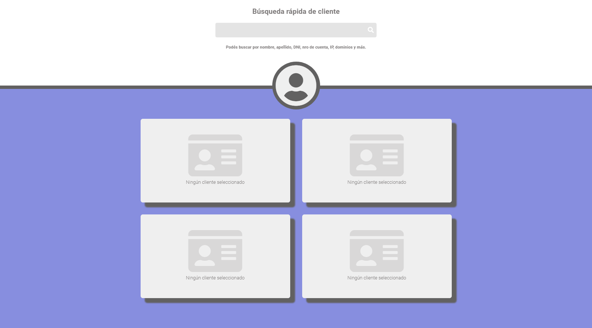

# infoClientes
 Info de clientes para soporte técnico

La idea es visualizar con un solo pantallazo los datos más importantes de cada cliente para que soporte puede dar un mejor servicio encontrando la información rápidamente.

[Avances mockup en GH Pages](https://latincloud.github.io/infoClientes/)

## Front

Este repo contiene el markup que luego va a ser implementado dentro de WHMCS.

[Ver diseño en Figma](https://www.figma.com/file/8zFYVAHK95dGxQjxqc63xd/infoClientes?node-id=1%3A2)

status diseño: aprobado por Fer y Fede ✅

## Back

Se está trabajando en WH. Ver avances en: https://devclientes.latincloud.com/lcAdmin/addonmodules.php?module=infocliente

## Pedido original

Ver PDF con características y scope en este mismo repo (Panel de Información de clientes.pdf)